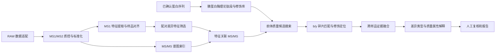

# Vedolizumab 生物类似药肽图 LC-MS/MS 差异组分鉴定与推测功能设计

## 1. 设计目标

本项目的目标不是把一个差异峰直接强行命名，而是建立一条可追溯的证据链：

> MS1 差异特征 → 前体离子/保留时间 → 序列候选肽段 → MS/MS 碎片证据 → 修饰或变体定位 → 差异解释 → 人工复核

首版面向当前目录中的两份 Thermo RAW 数据：

- `20260407_QL2519_20260316_T5-3G6-ProA_Trypsin_PTM.raw`
- `20260407_Vedolizumab_12756432_Trypsin_PTM.raw`

文件名提示这是胰蛋白酶酶解肽图并考虑 PTM，但酶切、还原/烷基化、采集模式和样品分组仍必须由实验信息确认，不能仅依据文件名写死。

当前两份数据各只有一个 RAW 文件，因此第一版报告应定义为“单次运行的探索性配对比较”：可以输出差异、候选结构和证据等级，但不能把组间差异显著性、批间稳定性或生物等效性作为结论。

## 2. 总体架构



系统分为五层：

1. 数据适配层：读取 RAW，或读取已转换的 mzML；
2. 差异发现层：复用已有的 LC-MS 特征识别、RT 对齐、XIC 和峰面积比较；
3. 鉴定引擎：序列驱动的理论肽段、修饰候选和碎片匹配；
4. 证据与解释层：候选排序、置信度、差异类型和质量属性映射；
5. 复核与报告层：谱图、色谱图、证据明细、审计记录和导出。

## 3. 数据审计和标准化

### 3.1 RAW 适配器

RAW 解析不能和业务逻辑耦合。适配器至少要输出以下统一对象：

- `Scan`：扫描号、MS level、RT、极性、扫描类型、激活方式、碰撞能量；
- `Precursor`：前体 m/z、电荷、母扫描号、隔离窗口、强度；
- `Spectrum`：MS1 或 MS2 的 m/z-强度数组、扫描号、RT、前体关联；
- `Feature`：m/z、RT、面积、峰高、同位素簇、电荷和样品信息。

适配器应保留原始文件 SHA-256、解析器版本和转换参数。当前已复用 ThermoRawFileParser 2.0.0 将两份 RAW 转换为 indexed mzML，并完成扫描级读取验证：

| 样品 | MS1 | MS2 | 前体 m/z | 仪器电荷 | 进样体积 | 碎裂 |
|---|---:|---:|---:|---:|---:|---|
| QL2519 | 4,989 | 17,732 | 17,732 | 13,969 | 15 | HCD 25 eV |
| Vedolizumab | 4,964 | 17,768 | 17,768 | 14,324 | 24 | HCD 25 eV |

仪器为 Q Exactive Plus Orbitrap，RT 约 0–60 min，MS2 均带前体 m/z；未给出仪器电荷的 MS2 由搜索引擎尝试有限电荷范围。两份数据记录的进样体积不同，在确认上样浓度和样品负载前，原始面积比不能直接归因为产品差异；局部 TIC 归一化结果也应保留为探索性排序。后续每次分析仍需记录：

- 总扫描数、MS1 扫描数、MS2 扫描数；
- RT 范围、总离子流和基峰流；
- DDA、DIA 或其他采集方式；
- MS2 的隔离窗口、碎裂方式和碰撞能量；
- 是否存在前体电荷和母扫描关联。

### 3.2 样品清单

样品名称不能直接等同于分析分组，应建立可编辑的 manifest：

```yaml
samples:
  - sample_id: S01
    display_name: QL2519
    group: biosimilar_or_reference
    raw_file: 20260407_QL2519_20260316_T5-3G6-ProA_Trypsin_PTM.raw
  - sample_id: S02
    display_name: Vedolizumab
    group: reference_or_biosimilar
    raw_file: 20260407_Vedolizumab_12756432_Trypsin_PTM.raw
experiment:
  enzyme: trypsin
  digestion_mode: confirm_before_search
  acquisition: auto_detect
  sequence_set: user_verified_fasta
```

需要由用户确认的元数据包括：QL2519 与 Vedolizumab 哪一个是参照药、是否还原/烷基化、烷基化试剂、是否允许漏切、是否为 DDA，以及两份数据是否使用相同前处理和采集方法。

### 3.3 质控门槛

在差异分析前生成数据审计卡片。至少包括：

- TIC/BPC、MS1 和 MS2 扫描分布；
- 前体数量、MS2 触发率和前体电荷分布；
- 总离子流、RT 范围和主要峰的 RT 偏移；
- MS1 特征数、可配对特征数、仅单样品出现的特征数；
- 质量误差和同位素模式质量；
- MS2 谱图的信噪比、峰数和低质量谱图比例。

若某个差异峰没有关联到有效 MS2，只能报告为“MS1 层面的差异”，不能进入高等级肽段鉴定。

## 4. 序列驱动的候选生成

### 4.1 序列输入

序列必须由用户提供或导入经过核对的 FASTA/序列表，并进行版本化。至少保存：链名称、序列、来源、版本、链起止位置、CDR/框架/恒定区注释和二硫键注释。

vedolizumab 生物类似药的鉴定不应默认使用公开数据库中相似抗体的序列；若 QL2519 存在专有序列、表达构建差异或工程化位点，应将其作为独立序列集合搜索。

### 4.2 理论肽段

首版建议支持：

- 胰蛋白酶规则切：K/R 后切，R/K 后接 P 时按规则处理；
- 0–2 次漏切作为默认范围，具体值可配置；
- 半特异性切割作为可选搜索；
- 肽段长度、前体电荷和质量范围过滤；
- 固定修饰、可变修饰和位点规则分离管理；
- 每条肽段的链、起止位置、基础序列、理论中性质量和所有修饰组合。

### 4.3 首版修饰库

修饰库必须是配置项，不应写死在代码中。优先级如下：

| 层级 | 典型内容 | 作用 |
|---|---|---|
| 固定 | 按实验条件确认的 Cys 烷基化 | 反映前处理后的基础质量 |
| 常见可变 | Met 氧化、Asn/Gln 脱酰胺 | 首版差异解释重点 |
| N 端加工 | Gln/Glu 焦谷氨酸化 | 支持肽段 N 端加工变体 |
| 终端加工 | C 端加工、截短、半特异性肽 | 支持产品异质性解释 |
| 扩展 | 糖肽/糖型、糖化、非预期加合物 | 第二阶段以后 |
| 未知 | 开放质量偏移、单氨基酸替换 | 未解释差异的后续搜索 |

每个修饰需要定义质量变化、允许残基、允许位置、最大组合数、是否允许定位和报告名称。变量修饰组合应设置上限，防止搜索空间膨胀。

## 5. 差异特征和 MS/MS 关联

### 5.1 差异特征

复用已有 MS1 工作流得到对齐后的 `Feature`，并补充肽图需要的字段：

- m/z、推定电荷和中性质量；
- RT、峰面积、峰高和 XIC 边界；
- 同位素簇和单同位素峰判定；
- 两个样品的面积、存在/缺失状态和 log2 fold change；
- 匹配到的 MS2 扫描数和最佳谱图；
- 是否可被同一基础肽段的不同修饰形式解释。

两份单次运行数据不使用 t 检验或组间 p 值。差异排序采用面积比、存在/缺失、质量误差、RT 一致性、MS2 证据和峰形质量的组合；阈值全部写入参数文件并在报告中展示。

### 5.2 MS2 关联

关联顺序：

1. 由仪器元数据读取 MS2 前体 m/z、电荷和隔离窗口；
2. 用 RT 窗口、前体质量和样品内特征边界关联 MS1 feature；
3. 一个 feature 保留全部候选 MS2，同时选出信号最强、质量误差最小和综合质量最高的代表谱图；
4. 若为 DIA，则按隔离窗口和共洗脱信息建立混合谱图，并降低单谱图鉴定置信度；
5. 跨样品比较时，优先比较同一候选肽段的代表谱图，而不是简单比较原始峰数。

## 6. 肽段和碎片鉴定

### 6.1 搜索顺序

采用分层搜索，避免先用开放搜索吞掉可解释的已知差异：

1. **封闭搜索**：已确认序列、胰蛋白酶规则、固定修饰和常见可变修饰；
2. **差异解释**：同一基础肽段的未修饰/修饰形式跨样品比较；
3. **开放搜索**：对仍未解释的差异特征聚类质量偏移；
4. **变体/截短搜索**：半特异性切割、单氨基酸替换和局部序列解释；
5. **人工辅助解释**：从头序列、糖肽诊断离子和需要正交方法确认的候选。

### 6.2 前体匹配

候选筛选至少综合：

- 单同位素前体质量误差；
- 电荷态和同位素间距；
- RT 是否位于同一基础肽段的合理窗口；
- XIC 峰形和样品内共洗脱；
- 是否有多个独立 MS2 支持。

质量容差、RT 容差和电荷范围必须可配置。候选列表中保留替代候选及淘汰原因，不只保存一个最佳名称。

### 6.3 碎片匹配

针对首版 HCD/CID 肽图预测并匹配 b/y 离子，必要时加入碎片电荷、常见中性丢失和修饰保留规则。每个候选保存：

- 匹配碎片的 m/z、理论 m/z、误差、离子类型和电荷；
- 连续 b/y 离子序列；
- 匹配碎片数和碎片覆盖率；
- 解释的总离子强度比例；
- 支持修饰位置的定位离子；
- 未解释的强峰和可能的干扰峰。

修饰位点不能只由前体质量确定。若多个位点具有相同质量且缺乏区分性碎片，报告必须写成“修饰类别已支持、位点未完全定位”。

### 6.3.1 组分级多谱联合推测

对尚未获得 B/C 级序列证据、但已按中性质量、共洗脱、XIC 峰形和样品变化趋势合并的 MS1 组分，系统可联合检索同组不同电荷态和同位素成员的 MS2。候选肽先由组分中性质量在当前 20 ppm 范围内筛选；每张 MS2 只归给最接近的一个成员，再在候选层汇总不同谱图中不重复的 b/y 离子位置。仅使用真正选中该前体或其同位素峰的 MS2，不使用仅被隔离窗覆盖的谱图。

当前联合推测需同时满足：target-decoy `q ≤ 1%`、联合得分 `≥45`、至少 5 个不重复匹配离子、碎片覆盖率 `≥15%`，并且至少有 2 张谱和 2 个组内 Feature 提供有效片段。已有 B/C 级证据的 Feature 不重复搜索；D 级单谱证据仍允许进入联合检索，以便由其他电荷态或同位素成员补强。通过结果标记为“组分多电荷/同位素联合推测（C 级）”，不得等同于直接前体确证；同一候选最终按肽段形式和 RT 合并为一个组分行。

### 6.3.2 开放质量差、序列标签与截断变体推断

严格前体质量搜索仍无法解释的 MS1 组分，进入第二层开放推断。系统先由不同电荷态/同位素成员推算组分中性质量，再从已知重链、轻链序列生成全酶切肽、最多 4 个漏切肽，以及从理论酶切肽单方向去除最多 20 个残基的 N 端或 C 端截断候选。N 端和 C 端截断作为明确的序列候选保存，不与“未知修饰”混为一类。

候选初筛允许组分质量与肽段骨架存在 `-250～+2500 Da` 的质量差。碎片匹配同时检查未偏移和带相同质量差的 b/y 离子，并在所有真正选中组内前体的 MS2 中汇总连续离子标签、互补 b/y 对、覆盖率、解释强度、扫描数、电荷态数和组内成员数。随后比较最佳候选与次优序列/位点的得分间隔，避免仅凭几个零散碎片把任意质量差套到短肽上。

升级为 C 级“骨架序列支持”至少需要：`q ≤ 1%`、得分 `≥45`、至少 5 个不重复离子、覆盖率 `≥6%`、连续序列标签长度 `≥2`，至少 2 张谱和 2 个组内成员支持，且候选间得分差 `≥3`。此外，短于 8 个氨基酸且带较大未知质量差的候选不能升级；只有质量差接近零的明确 N/C 端截断，或质量差能对应已知修饰时才可例外。证据结构较好但候选不唯一者仅报告为 D 级“部分 b/y 序列区域候选”，不视为肽段鉴定。

输出必须区分三种解释：`truncation_sequence_supported` 表示已知序列内的 N/C 端截断骨架得到支持；`backbone_sequence_supported` 表示骨架序列得到支持但质量差仍可能是修饰、加合物或其他变化；`sequence_region_candidate` 只表示局部 b/y 标签与某段序列相容。开放质量差不能单独证明修饰名称或位点，截断候选也仍需人工查看端点附近的区分性离子。

### 6.4 候选评分和 FDR

候选分数由以下证据组成，权重可配置：前体质量、同位素/电荷、碎片匹配数量、碎片强度解释率、离子系列连续性、修饰定位、RT 和重复谱图一致性。评分结果同时保留各分项，便于人工复核。

FDR 不能只在预先挑出的差异峰上计算。正式搜索应对完整可检测候选集或完整理论肽段集进行 target-decoy 估计；差异结果只是搜索完成后的一个筛选视图。目标/诱饵比例、PSM/肽段级 FDR 和过滤阈值均需写入报告。

## 7. 差异类型和推测功能

### 7.1 差异类型判定

系统将两个样品的候选结果归并到“基础肽段—变体”层级，输出以下互斥优先级：

| 类型 | 解释 |
|---|---|
| 同一肽段丰度差异 | 序列和修饰一致，主要是峰面积不同 |
| 修饰比例差异 | 同一基础肽段的未修饰与修饰形式比例不同 |
| 修饰类型差异 | 一方出现另一方未出现的氧化、脱酰胺或 N 端加工等 |

当前实现按“基础肽段 + 修饰质量形式 + 色谱峰”归并证据：同一形式的不同电荷态以及 M/M+1/M+2 同位素峰不再作为独立差异组分重复排名。对于显著 MS1 Feature 中获得修饰候选的肽段，系统从 Peak-first SQLite 的全程 MS1 谱图中自动提取修饰态和未修饰母肽的多电荷 XIC，分别进行峰检测和 TIC 面积归一化，并输出各样品的 `modified/unmodified` 比值及两形式表观比例 `modified/(modified+unmodified)`。至少两个可比较电荷态呈现同方向时记录为一致支持；方向不一致时标记为 mixed 并要求人工复核。若相同质量的不同位点候选缺乏定位碎片，例如 `Oxidation@1 / Oxidation@12`，保留为一条带替代位点的结果，不重复计算。表观比例仅用于样品间半定量，不代表标准品校正后的绝对占有率，也不代表所有糖型或全部修饰形式之和。
| 序列/工程变体候选 | 前体和碎片支持不同氨基酸或独特肽段 |
| 截短/异常酶切候选 | 半特异性或非预期肽段支持加工差异 |
| 糖肽候选 | 具有糖肽质量、糖链碎片或诊断离子证据 |
| 未解释质量偏移 | 有稳定差异但当前搜索空间不能解释 |
| 可能伪影 | 同位素、加合物、源内碎裂、共洗脱或低质量谱图 |

### 7.2 质量属性/功能关联

“功能推测”应解释为质量属性和潜在影响方向，不应仅凭一张 MS/MS 谱图直接宣称生物学功能已改变。系统可按序列区域和修饰类型生成风险提示：

- CDR 区域肽段的序列或修饰差异：标记为“潜在结合相关风险，需结合结合活性或结构数据验证”；
- 框架区肽段差异：标记为“潜在构象/稳定性相关线索”；
- Fc/铰链区肽段及糖肽差异：标记为“潜在 Fc 相关质量属性线索”；
- Met 氧化、Asn/Gln 脱酰胺、糖型和末端加工：分别映射到稳定性、构象/结合、效应功能相关或产品加工质量属性的候选解释；
- 非预期质量偏移：仅输出“待鉴定化学变体/加合物候选”，不自动赋予生物学功能。

映射规则存放在可版本化的知识库中，结果字段使用“提示/假设/待验证”，并附上序列位置、证据等级和建议验证方法。不能把“位于 CDR”直接等同于“活性改变”。

## 8. 置信度和人工复核

建议采用四级结果，而不是单一分数：

| 等级 | 允许表达的结论 |
|---|---|
| A：确认 | 序列、修饰和位点有充分碎片证据，并有标准品或正交方法支持 |
| B：高可信推定 | 前体、RT、碎片和修饰定位证据一致，尚无标准品/正交验证 |
| C：部分鉴定 | 肽段或修饰类别可支持，但位点、异构体或结构仍有歧义 |
| D：未知差异 | 只能确认存在差异，尚不能确定具体肽段或化学结构 |

每个差异 feature 的证据卡片应包含：XIC、MS1 同位素图、两样品 MS/MS 叠图、候选序列、修饰位置、匹配碎片表、质量误差、得分分项、替代候选、区域注释、差异解释和人工复核状态。

## 9. 首版功能边界

### MVP 必须完成

- RAW/mzML 适配和扫描级审计；
- MS1 feature 与 MS2 前体关联；
- 用户序列 FASTA 导入和版本记录；
- 胰蛋白酶理论肽段生成；
- 固定修饰和常见可变修饰封闭搜索；
- 前体与 b/y 碎片匹配；
- 两样品差异归并；
- 差异类型、证据等级和人工确认；
- CSV/Excel/HTML 证据报告。

### 第二阶段

- target-decoy FDR；
- 修饰定位评分和替代候选排序；
- 多重复 consensus spectrum；
- 开放质量偏移搜索；
- 序列变异和半特异性肽段搜索；
- CDR/框架/Fc 区域质量属性映射。

### 后续扩展

- 糖肽和糖型；
- 非还原二硫键连接肽；
- DIA 混合谱图解卷积；
- 从头测序；
- PRM/标准品/正交实验结果联动；
- 完整抗体、亚基和其他酶切方案。

## 10. 验证标准和实施顺序

实施顺序建议为：

1. 先安装或接入 RAW 解析器，完成两份文件的扫描审计；
2. 补齐样品分组、前处理和确认版 FASTA；
3. 用已知肽段或人工整理的谱图建立小型验证集；
4. 先实现封闭搜索和差异证据卡片；
5. 用手工谱图复核校准容差、评分和置信度阈值；
6. 再增加开放搜索、糖肽和序列变异功能。

首版验收至少包括：

- 已知序列肽段可被正确生成并在理论质量上闭环；
- 已知修饰能在正确残基和正确碎片上被定位；
- 低质量、无 MS2 或明显共洗脱的 feature 不会被错误标为高可信；
- 两样品相同肽段与修饰比例差异能被归并显示；
- 报告可追溯到 RAW 文件、扫描号、参数、序列版本和人工结论；
- 单次运行数据不会输出统计显著性或稳定性结论。

当前目录中最关键的下一步输入不是更多算法，而是：确认两份样品的角色、确认酶解/还原/烷基化条件、提供经过核对的序列 FASTA，并完成 RAW 扫描级审计。完成这四项后，才能把设计中的默认参数冻结为可执行分析配置。
